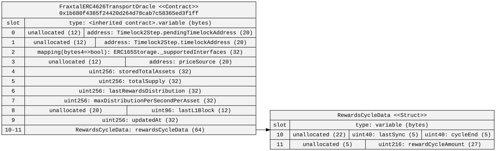
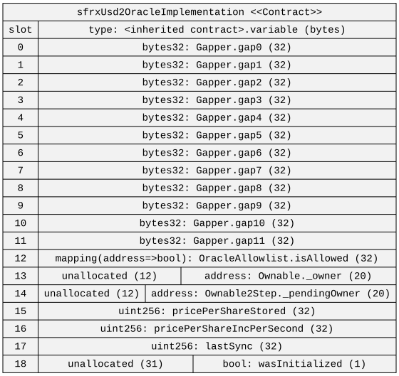

### SfrxUSD Oracle Implementation

#### Background 

Currently sfrxUSD's rate is read into the fraxtal L2 via a  [`0x1B680F4385f24420D264D78cab7C58365ED3F1FF`](https://fraxscan.com/address/0x1B680F4385f24420D264D78cab7C58365ED3F1FF) as well as a price source  [`0x3D7dD9014a9b7a1c8276378a39D322969587c64B`](https://fraxscan.com/address/0x3D7dD9014a9b7a1c8276378a39D322969587c64B) which verifies the inputs against mainnet state and then then pushes the inputs to the price accrual function onto the L2. Neither of these contracts are currently upgradable. The tenative plan is during the next hardfork the bytecode at the oracle address will be changed to a UUPS Upgradable proxy, functionally similar to the `vm.etch` opcode. The implementation for the proxy to be placed @  [`0x1B680F4385f24420D264D78cab7C58365ED3F1FF`](https://fraxscan.com/address/0x1B680F4385f24420D264D78cab7C58365ED3F1FF) is intended to be `SfrxUsd2OracleImplementation`. 

### Walkthrough 
Similar to the frxUSD2 implementation contract for mainnet. The implementation contract on fraxtal will consume the same three inputs to the price evolution function. `pricePerShareStored` `pricePerShareIncPerSecond` and `lasySync`. The price evolution function ought to be functionally equivalent to that on mainnet. 

#### Price Setting

The inputs to the price evolution function will first be set on ethereum mainnet, and then shortly be proxied over to the fraxtal oracle to ensure that prices between the two chains are functionally equivalent. In order to facilitate this process the `setAllPricingParams`, `setPricePerShareIncPerSecond`, and `setPricePerShareStored` are also available on the fraxtal oracle. These functions should be gated behind an allowlist to ensure that only approve senders are able to update these inputs and consequently the sfrxUSD price on the L2. 

#### Oracle Consumption 

In order to facilitate the consumption of the sfrxUSD price, the oracle will expose a chainlin AggregatorV3Interface `latestRoundData` view function as well as the IERC4626 `pricePerShare` function. 

#### Admin Gated Roles 

The implementation contract features a two ring permission system. in which an `Owner` is able to designate various addresses which are `allowed` to push prices via the three price setting functions. 

#### Storage Layout Considerations 

In order to avoid storage layout considerations between the current contracts storage layout and that of the new proxy implementation constellation, the first 11 storage slots have been gapped in the proposed implementation contract. 

#### Additional Notes

We will also be following the same upgrade pattern outlined here for [`0x1B680F4385f24420D264D78cab7C58365ED3F1FF`](https://fraxscan.com/address/0x1B680F4385f24420D264D78cab7C58365ED3F1FF) for the legacy sfrxUSD oracle [`0xF750636E1df115e3B334eD06E5b45c375107FC60`](https://fraxscan.com/address/0xf750636e1df115e3b334ed06e5b45c375107fc60), both will tentatively point at the same implementation contract. Which should have one less slot in use relative to [`0x1B680F4385f24420D264D78cab7C58365ED3F1FF`](https://fraxscan.com/address/0x1B680F4385f24420D264D78cab7C58365ED3F1FF), but should be fine given we are gapping the first 11 slots. (See layout Diagram attached below)

Current Layout 

Proposed Layout

